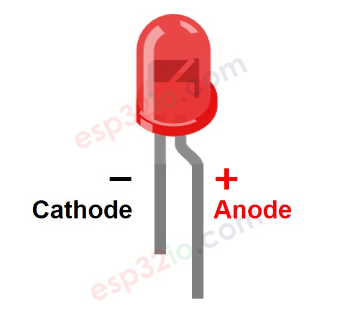
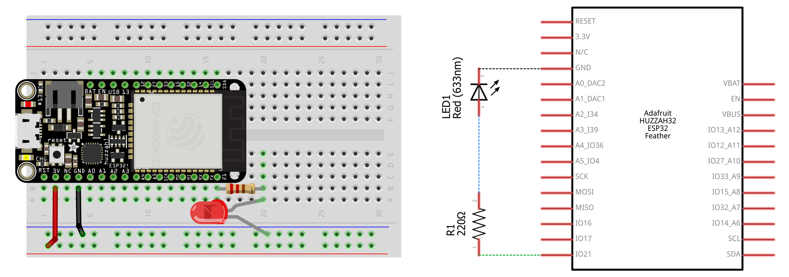
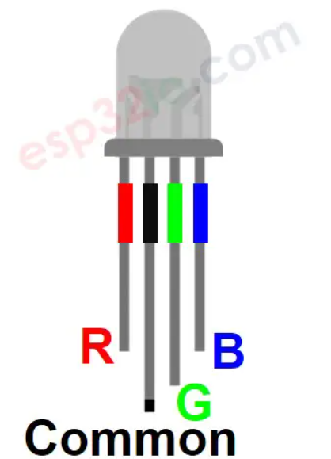
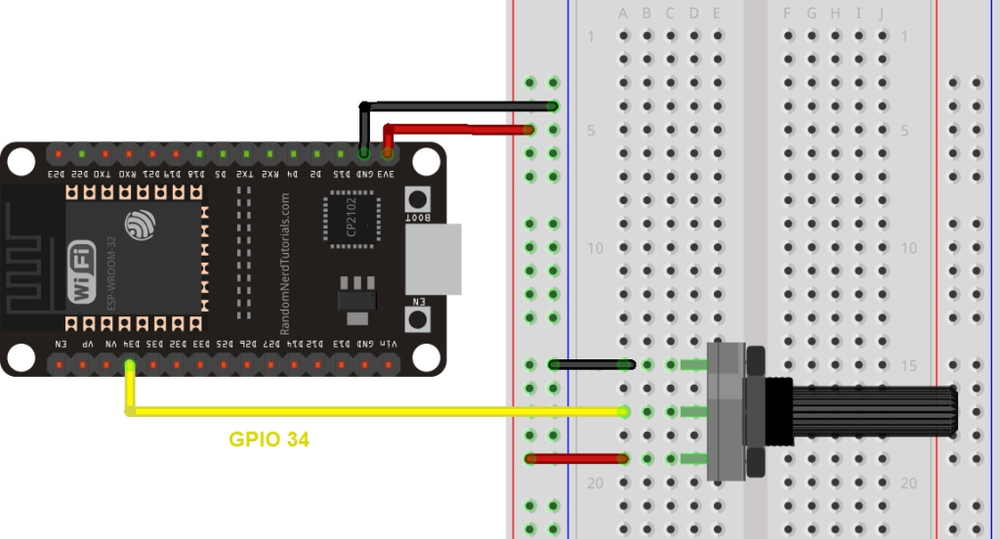

## Background:

In this section, we will provide a brief description of some of the electrical components being used in the tasks. Since we don't have any actuators or sensors in this lab, we will simulate them using LEDs (simple and RGB ones) and potentiometers (to simulate analog sensor input).

### LEDs:

#### Description:

LEDs operate based on the principle of electroluminescence, where upon application of a voltage across the semiconductor within the LED, light is emitted in the visible spectrum. The color of the light emitted depends on the bandgap of the semiconductor material.

Here's what your typical LED looks like, we have the longer terminal called "anode" and the shorter terminal, called "cathode".


An LED will light only when voltage is applied in the forward direction(anode to cathode) of the diode (that's what diodes do). No current flows and no light is emitted if voltage is applied in the reverse direction and if the reverse voltage exceeds the breakdown voltage, which is typically about five volts, a large current flows and the LED will be damaged. Ensuring correct electrical polarity is important while connecting LEDs in a circuit.

LEDs also generally need a current limiting resistor in series, otherwise the current can burn the LED. Therefore, you generally connect an LED by connecting appropriate resistance (330 Ohms, 220 Ohms etc. depending on the LEDs) in series. The longer terminal (anode) is connected with the positive voltage source, and the shorter terminal is connected to the ground. Here's what the connection looks like:



The LED is being driven by the GPIO 21.

### RGB LED:

RGB (Red-Green-Blue) LEDs are actually three LEDs in one! But that doesn't mean it can only make three colors. Because red, green, and blue are the additive primary colors, you can control the intensity of each to create every color of the rainbow. Most RGB LEDs have four pins: one for each color, and a common pin. The common pin in our case is anode (so it gets connected to positive voltage).



**Like an ordinary LED, we need to connect the individual color terminals to separate current limiting resistors**. RGB LEDs are driven by PWM input. ESP32 has a builtin PWM module specifically to drive LEDs called LEDC. If we generate PWM signals to R, G, B pins, the RGB LED diplays a color corresponding to the PWM duty cycle values. By changing the duty cycle of PWM signals (from 0 to 255), the RGB LED can display any color.

The file `rgb-demo.ino` shows an example of how one can use an RGB led.

### Potentiometer

The potentiometer consists of a resistive element and a sliding contact, allowing the user to adjust the electrical resistance by turning the knob or sliding the mechanism. The three terminals are typically labeled as the 'input' or 'common,' the 'output,' and the 'ground.' As the knob is turned or the slider is adjusted, the resistance between the input and output terminals changes, influencing the voltage at the output. Therefore by passing voltage through a potentiometer into an analog input to the ESP32, it is possible to measure the amount of resistance of the potentiometer as an analog value. 

Potentiometer can be connected by connecting the left shaft to 3v3 pin (outputs 3.3V) and the right shaft to ground. The middle shaft of the potentiometer is connected with an ADC enabled input pin on the ESP32, in order to read the output voltage from the potentiometer.



Here, e.g. GPIO34 is being used. Assuming pins have already been set, we can simply read the value in code then by:

```C
int value = analogRead(34);
```

# Tasks

## Task 1:

Using the ESP32, write a simple multi-threaded program that drives an LED, and an RGB LED. The simple LED needs to be driven at a frequency of 1.5 Hz, while the RGB LED should display the BLUE color only, and blinks at a frequency of 3 Hz. Consider how you would produce purely blue color on the RGB LED? 

The LEDs must be controlled by separate tasks only. That would involve the creation of two separate tasks, instead of only one as was shown in the slides. Note that the code running inside `loop()` is considered a separate task, and you should use this task only for logging purposes (if you want).

## Task 2:

Write an ESP32 program, that drives an RGB led, using a potentiometer. The potentiometer should act like the color knob of the LED i.e. as the resistance is changed by switching the knob, the rgb led color changes. **Note** that by default, ADC converts input ranging from 0V to 3.3V -> values between 0-4095. However, RGB values are generally between 0-255 (which is also the default resolution for `analogWrite()`). Therefore, you might need to do some conversion after reading the value.

## Task 3

In this task, we will explore the serial communication capabilities of ESP32. 

ESP32 provides three universal asynchronous receivers and transmitter (UART) ports such as UART0, UART1, and UART2 that work at 3.3V TTL level. These three serial interfaces are hardware supported. Each of them exposes 4 pins: RX, TX, RTS and CTS. However, the Arduino IDE only uses RX and TX pins. By default, only UART0 and UART2 can be used. To use UART1, we have to redefine the pins because default pins of UART1 such as GPIO9 and GPIO10 are internally connected to the SPI flash memory. Also, on some ESP32 boards, they are even exposed on the pinout headers. Hence, we can not use UART1 directly without reassigning pins in Arduino IDE.

The UART0 port is associated with the on board micro-usb, therefore, we can communicate using UART with our laptop.When we invoke `Serial.begin(9600)` in the `setup()`, we are using UART0. So far, we have only seen how to send data over this particular uart port via `Serial.println("hello\\n")` , which sends the string `hello\n` over serial to the laptop, where arduino's serial monitor receives the data and displays it. This data can be sent to any application as well. Consider the following application running on esp32. It sends a string to laptop after every second.

```c
void setup()
{
    // initializes uart0 to communicate at baudrate of 9600
    // this baudrate must be replicated at the other end as well
    Serial.begin(9600);
}

void loop()
{
    // Serial.println sends a \n terminated string via uart0, over the microusb
    Serial.println("Hello World!");
    delay(1000);
}
```

We can use a `python` module called `pyserial` to read the serial data. That data can be read as follows (assuming `pyserial` is installed, if not we can install via `pip`).

```python
import serial

# Identify the port your ESP32 is connected to, from the Arduino IDE (Board + Port) shown at the bottom right
port = '/dev/ttyUSB0' 

with serial.Serial(port, 9600, timeout=2) as ser:
    while True:
        line = ser.readline()
        line.strip()
        print("Got word from esp32 : ", line)
```

We can also send data from PC to ESP32 by using 

```python
with serial.Serial(port, baudrate, timeout) as ser:
    ser.write(b'Helloo')
```

which writes string "Helloo" over serial. This can be read by esp32 as well, as follows:

```c
// checks if data is coming over serial
if (Serial.available()) {
	// reads until the newline character
	String command = Serial.readStringUntil('\n'); 
	// data can be used here in some meaningful way
}
```

Using this, we can write a simple program to control an LED directly from the PC. The PC can act as the control server for the LED.

The following program expects an "ON" or an "OFF" command, and controls the internal LED state via those. The example is available under the directory `serial-demo.`

```c
void setup()
{
    // initiate serial communication at baudrate of 115200
    Serial.begin(115200);
    // set the internal led pin to output mode
    pinMode(LED_BUILTIN, OUTPUT);
}

void loop()
{
    // listen for available data, if available parse, otherwise keep looping
    if (Serial.available())
    {
        // read till you encounter a new line
        String data = Serial.readStringUntil('\n');
        if (data == "ON")
        {
            digitalWrite(LED_BUILTIN, HIGH); // turn on LED
        }
        else if (data == "OFF")
        {
            digitalWrite(LED_BUILTIN, LOW); // turn off LED
        }
    }
}
```

```python
# serial-demo.py
import serial

with serial.Serial('/dev/ttyUSB0', 115200, timeout=2) as ser:
    while True:
        inp = input('Enter command : ')
        ser.write(bytes(inp, 'utf-8'))
```

### Requirements:

Since, we have the pre-requisites for two way serial between the pc, and the esp32, we can simulate a simple client-server example.  Your task is to write a simple python based (suggested, though not necessary) web server that serves a simple html page. The page displays a simple text box, and a simple button. There are no styling requirements at all, only the default `Button` and `Input` without any CSS styling is fine. When the button is pressed, the data is sent to ESP32. ESP32 should calculate a simple hash of the received input and send it back, over serial, to the PC, which should display the received hash on console.

If you are unfamiliar with writing a simple backend, have a look at the package `flask`, and its documentation. The documentation gives a straight forward example on how to create a basic web server, that can serve a simple HTML document. Otherwise, feel free to use whatever you are comfortable with.
If someone wants to use Javascript/Typescript they can look into the js package `serialport`. 

# Submission Instructions:

For the first two tasks, submit the `.ino` file in the following format : `<taskX>.ino` where `X` is the task number. For the third task, kindly zip all the files, necessary to run your program, compress as a zip archive named as `task3.zip` and submit. The submissions will be done on the LMS.
